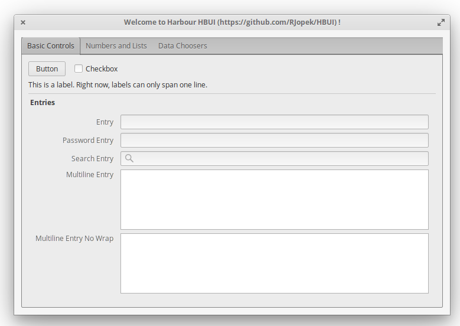

# **hbui**
---
Graphical user interface library for the Harbour compiler, this is a wrapper library around [libui](https://github.com/andlabs/libui), a portable GUI library.

- Read more about the - [Cross platform](https://en.wikipedia.org/wiki/Cross-platform)
- Read more about the - [Harbour (software)](https://en.wikipedia.org/wiki/Harbour_(software))

### How to get
- first of all please download [Harbour](https://github.com/harbour/core)
- hbui live source repository

You'll need Git version control software installed on your system, and issue this command:
```
$ git clone git://github.com/RJopek/hbui
```
You can get subsequent updates using this command:

```
git pull
```

### How to build
- on Windows, Unix, Darwin

```
> hbmk2 hbui.hbp
```
To test it, type:
```
$ cd docs/tutorial
$ hbmk2 window.prg
```

### Sample source code
```
FUNCTION Main()
    LOCAL w

    w := uiNewWindow("main Window",800,600,.T.)

    ? "pointer:", w

    uiControlShow( w )

    uiMain()
    uiUninit()

RETURN nil
```

### Screenshots





### License
---
MIT

**Free Software, Hell Yeah!** ;-)

###### All trademarks and company names are used for information purposes only.
